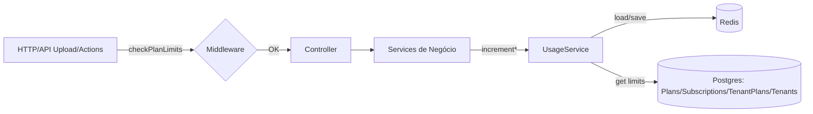

# Billing Usage Tracking

Este documento descreve a arquitetura de tracking de uso e limites de plano no Zechat V1.

## Visão Geral

- Serviço central: `UsageService` (Redis + Postgres para limites)
- Métricas rastreadas por tenant e por mês (YYYYMM):
  - messages
  - storageBytes
  - users
  - whatsappSessions
- Limites obtidos de `Plan.limits` via `Subscription` (ativa) ou `TenantPlan` (ativa) e overrides de `Tenant.maxUsers`/`maxConnections`.



## Armazenamento das Métricas

- Chave Redis por tenant e mês: `usage:${tenantId}:${yyyyMM}`
- Estrutura armazenada (JSON):
  ```json
  {
    "messages": 0,
    "storageBytes": 0,
    "users": 0,
    "whatsappSessions": 0
  }
  ```

## Limites

- Fonte de verdade: `Plan.limits` (whatsappSessions, messagesPerMonth, storageGB, users)
- Fallbacks: Defaults (messagesPerMonth=1000, storageGB=5, users=10, whatsappSessions=1)
- Overrides do Tenant: `maxUsers` e `maxConnections`

## Pontos de Integração Implementados

- Mensagens:
  - `CreateMessageSystemService` → `incrementMessages(tenantId, 1, bytes)`
- Usuários:
  - `CreateUserService` → `incrementUsers(tenantId, 1)`
- Sessões WhatsApp:
  - `StartWhatsAppSession` → `incrementWhatsappSessions(tenantId, 1)`
- Storage (upload):
  - `messageRoutes` (POST /messages/:ticketId) → `checkPlanLimits('storage')`
  - `ContactController.upload` (POST /contacts/upload) → `checkPlanLimits('storage')` + `incrementStorage(totalBytes)`
  - `CampaignController.store/update` (POST/PUT /campaigns) → `checkPlanLimits('storage')` + `incrementStorage(totalBytes)`

## TODOs Técnicos (Prioridade)

- Alta: Aplicado (já feito nesta fase)
  - `TenantBillingController.listPlans` usar `Plan.scope('active')` e ordenar por `price ASC`.
  - Validar e incrementar `storage` em uploads de contatos e campanhas.

- Média: Planejado (deixar como TODO no código)
  - Aplicar `checkPlanLimits('storage')` e `incrementStorage` em:
    - `hubMessageRoutes`
    - `apiExternalRoutes`

- Escalabilidade/Confiabilidade (Futuro)
  - Atomicidade Redis: substituir RMW por `HINCRBY/INCRBY` quando necessário.
  - Retenção/Agregação: TTL (~90 dias) e job de consolidação mensal para Postgres `tenant_usage_history`.
  - Testes de integração para limites e cenários edge (tenant sem plano, plano sem limites, etc.).

## Como adicionar novos pontos de tracking

1. Antes de consumir o recurso, aplique `checkPlanLimits('<tipo>')` na rota (messages | storage | users | whatsappSessions).
2. Após operação bem-sucedida, incremente a métrica correspondente via `UsageService.increment*`.
3. Garanta `tenantId` em todo o fluxo.
4. Logue ocorrências de `PLAN_LIMIT_EXCEEDED` via logger.warn para auditoria.

## Observações

- O escopo `Plan.scope('active')` já existe no model.
- Alguns campos solicitados no retorno de planos (currency, description, billingCycle) ainda não existem no model atual; quando adicionados, incluir no `attributes` do controller.
