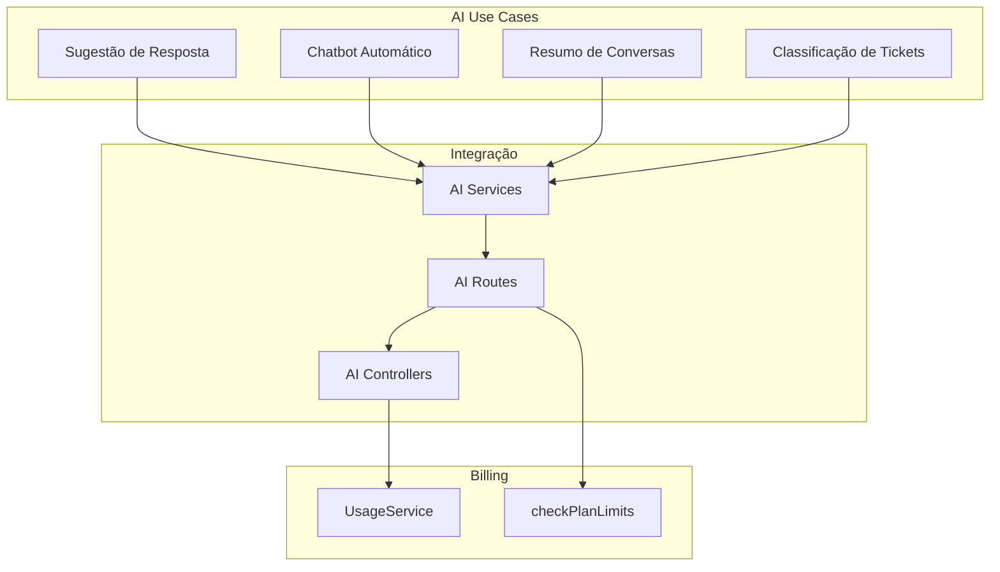
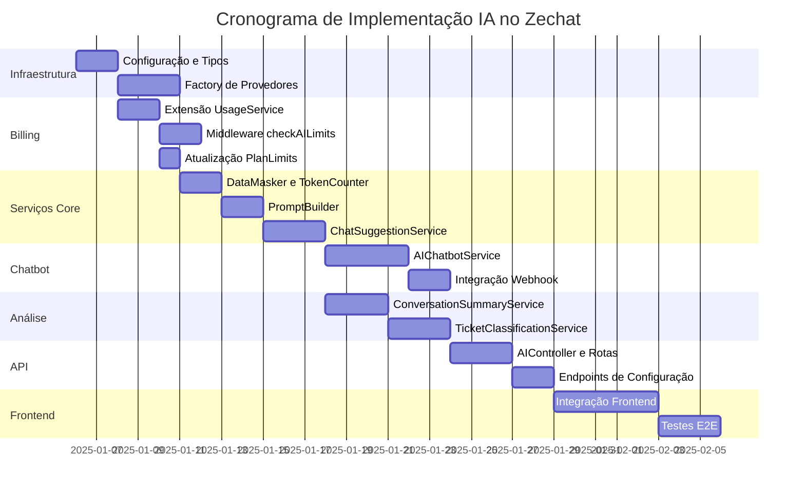
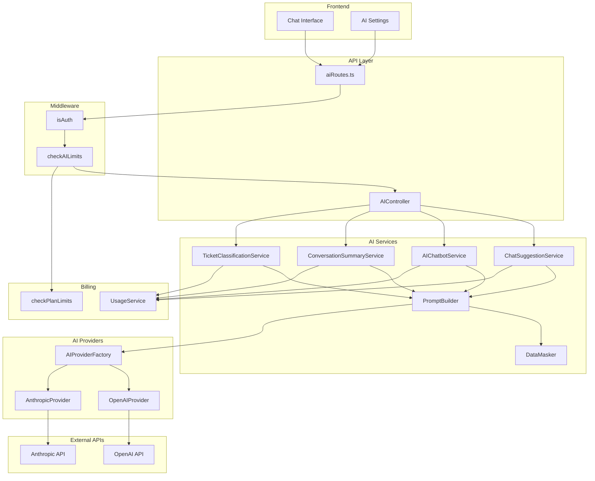

# Plano de Arquitetura: Integração de IA no Zechat

## 1. Análise do Projeto

### 1.1 Módulos de Mensagens/Chat Identificados

| Módulo | Caminho | Responsabilidade |
|--------|---------|------------------|
| **MessageController** | `backend/src/controllers/MessageController.ts` | CRUD de mensagens |
| **TicketController** | `backend/src/controllers/TicketController.ts` | CRUD de tickets |
| **Message Model** | `backend/src/models/Message.ts` | Armazena mensagens (com `tenantId`) |
| **Ticket Model** | `backend/src/models/Ticket.ts` | Armazena tickets (com `tenantId`) |
| **ChatFlow** | `backend/src/models/ChatFlow.ts` | Sistema de chatbot existente |
| **AutoReply** | `backend/src/models/AutoReply.ts` | Sistema de auto-resposta |
| **WbotServices** | `backend/src/services/WbotServices/` | Serviços WhatsApp |
| **MessengerChannelServices** | `backend/src/services/MessengerChannelServices/` | Serviços Facebook Messenger |
| **WABA360** | `backend/src/services/WABA360/` | Serviços WhatsApp Business API |

### 1.2 Billing/UsageService e Limites de Plano

| Componente | Caminho | Descrição |
|------------|---------|-----------|
| **UsageService** | `backend/src/services/BillingServices/UsageService.ts` | Rastreia métricas de uso via Redis |
| **Plan Model** | `backend/src/models/Plan.ts` | Define limites em JSONB (`PlanLimits`) |
| **Subscription** | `backend/src/models/Subscription.ts` | Gerencia assinaturas de tenants |
| **checkPlanLimits** | `backend/src/middleware/checkPlanLimits.ts` | Middleware de validação de limites |

**Métricas atuais rastreadas:**
- `messages` - mensagens por mês
- `storageBytes` - armazenamento em bytes
- `users` - número de usuários
- `whatsappSessions` - sessões WhatsApp

**Chave Redis:** `usage:{tenantId}:{yyyyMM}`

### 1.3 APIs REST Existentes

| Categoria | Base Path | Middleware |
|-----------|-----------|------------|
| Mensagens | `/api/messages` | `isAuth`, `checkPlanLimits` |
| Tickets | `/api/tickets` | `isAuth` |
| ChatFlow | `/api/chat-flow` | `isAuth` |
| AutoReply | `/api/auto-reply` | `isAuth` |
| Billing | `/api/billing` | `isAuth` |
| TenantPlan | `/api/tenant-plan` | `isAuth` |

---

## 2. Arquitetura de IA para Zechat

### 2.1 Pontos de Uso da IA



### 2.2 Detalhamento por Ponto de Uso

#### 2.2.1 Sugestão de Resposta para Atendente

**Objetivo:** Sugerir respostas automáticas para o atendente humano enquanto digita.

| Aspecto | Detalhe |
|---------|---------|
| **Serviço** | `backend/src/services/AI/ChatSuggestionService.ts` |
| **Endpoint** | `POST /api/ai/suggestions` |
| **Trigger** | Frontend envia contexto da conversa |
| **TenantId** | Obtido de `req.user.tenantId` |
| **Billing** | Contabiliza como `aiSuggestions` |

**Fluxo:**
1. Frontend envia últimas N mensagens do ticket
2. Service constrói prompt com contexto mascarado
3. Chama LLM API
4. Registra uso no UsageService
5. Retorna sugestões

#### 2.2.2 Chatbot Automático (AI-Powered)

**Objetivo:** Chatbot inteligente que responde antes do atendente humano.

| Aspecto | Detalhe |
|---------|---------|
| **Serviço** | `backend/src/services/AI/AIChatbotService.ts` |
| **Endpoint** | `POST /api/ai/chatbot/reply` |
| **Trigger** | Mensagem recebida em ticket sem atendente |
| **TenantId** | Obtido do ticket |
| **Billing** | Contabiliza como `aiChatbotCalls` |
| **Configuração** | `Setting` com chave `ai:chatbot:enabled` |

**Fluxo:**
1. Webhook de mensagem chega
2. Verifica se ticket tem `chatFlowId` de IA
3. Service constrói prompt com histórico
4. Chama LLM API
5. Registra uso no UsageService
6. Cria mensagem via `CreateMessageSystemService`

#### 2.2.3 Resumo de Conversas

**Objetivo:** Gerar resumo automático de conversas longas.

| Aspecto | Detalhe |
|---------|---------|
| **Serviço** | `backend/src/services/AI/ConversationSummaryService.ts` |
| **Endpoint** | `POST /api/ai/tickets/:ticketId/summary` |
| **Trigger** | Solicitação manual ou automática |
| **TenantId** | Obtido de `req.user.tenantId` |
| **Billing** | Contabiliza como `aiSummaries` |

**Fluxo:**
1. Busca todas mensagens do ticket
2. Service constrói prompt com histórico completo
3. Chama LLM API
4. Registra uso no UsageService
5. Salva resumo em novo campo `summary` no Ticket

#### 2.2.4 Classificação de Tickets

**Objetivo:** Classificar tickets automaticamente por categoria/prioridade.

| Aspecto | Detalhe |
|---------|---------|
| **Serviço** | `backend/src/services/AI/TicketClassificationService.ts` |
| **Endpoint** | `POST /api/ai/tickets/:ticketId/classify` |
| **Trigger** | Ao criar ticket ou manual |
| **TenantId** | Obtido do ticket |
| **Billing** | Contabiliza como `aiClassifications` |

**Fluxo:**
1. Analisa primeiras mensagens do ticket
2. Service constrói prompt para classificação
3. Chama LLM API
4. Registra uso no UsageService
5. Atualiza tags/fila do ticket

---

## 3. Integração com Billing e Limites de Uso

### 3.1 Extensão do UsageService

**Novas métricas a adicionar em `UsageMetrics`:**

```typescript
export type UsageMetrics = {
  messages: number;
  storageBytes: number;
  users: number;
  whatsappSessions: number;
  // Novas métricas de IA
  aiSuggestions: number;
  aiChatbotCalls: number;
  aiSummaries: number;
  aiClassifications: number;
  aiTokensUsed: number;  // Total de tokens consumidos
};
```

**Novos métodos em `UsageService.ts`:**

```typescript
async incrementAISuggestions(tenantId: number, count: number): Promise<void>
async incrementAIChatbotCalls(tenantId: number, count: number): Promise<void>
async incrementAISummaries(tenantId: number, count: number): Promise<void>
async incrementAIClassifications(tenantId: number, count: number): Promise<void>
async incrementAITokens(tenantId: number, tokens: number): Promise<void>
```

### 3.2 Extensão do PlanLimits

**Novos limites em `PlanLimits`:**

```typescript
export interface PlanLimits {
  messagesPerMonth: number;
  storageGB: number;
  users: number;
  whatsappSessions: number;
  // Novos limites de IA
  aiSuggestionsPerMonth: number;
  aiChatbotCallsPerMonth: number;
  aiSummariesPerMonth: number;
  aiClassificationsPerMonth: number;
  aiTokensPerMonth: number;
}
```

### 3.3 Regras por Plano

| Plano | Sugestões/mês | Chatbot/mês | Resumos/mês | Classificações/mês | Tokens/mês |
|-------|---------------|-------------|-------------|-------------------|------------|
| **Starter** | 100 | 50 | 10 | 50 | 10.000 |
| **Pro** | 1.000 | 500 | 100 | 500 | 100.000 |
| **Enterprise** | Ilimitado | Ilimitado | Ilimitado | Ilimitado | 1.000.000+ |

### 3.4 Novo Middleware

**Arquivo:** `backend/src/middleware/checkAILimits.ts`

```typescript
type AILimitType = "aiSuggestions" | "aiChatbotCalls" | "aiSummaries" | "aiClassifications" | "aiTokens";

export default function checkAILimits(limitType: AILimitType) {
  // Valida limites específicos de IA antes de chamar LLM
}
```

---

## 4. Segurança e Configuração

### 4.1 Credenciais de API

**Variáveis de Ambiente:**

```bash
# OpenAI
OPENAI_API_KEY=sk-...
OPENAI_ORGANIZATION=org-...
OPENAI_MODEL=gpt-4o-mini

# Anthropic (alternativa)
ANTHROPIC_API_KEY=sk-ant-...
ANTHROPIC_MODEL=claude-3-haiku-20240307

# Configurações gerais
AI_PROVIDER=openai  # ou 'anthropic'
AI_MAX_TOKENS=1000
AI_TEMPERATURE=0.7
```

**Arquivo de Configuração:** `backend/src/config/ai.ts`

```typescript
export default {
  provider: process.env.AI_PROVIDER || 'openai',
  openai: {
    apiKey: process.env.OPENAI_API_KEY,
    organization: process.env.OPENAI_ORGANIZATION,
    model: process.env.OPENAI_MODEL || 'gpt-4o-mini',
    maxTokens: parseInt(process.env.AI_MAX_TOKENS || '1000'),
    temperature: parseFloat(process.env.AI_TEMPERATURE || '0.7')
  },
  anthropic: {
    apiKey: process.env.ANTHROPIC_API_KEY,
    model: process.env.ANTHROPIC_MODEL || 'claude-3-haiku-20240307'
  }
};
```

### 4.2 Configuração por Tenant

**Uso do modelo `Setting`:**

| Chave | Valor | Descrição |
|-------|-------|-----------|
| `ai:enabled` | `true/false` | IA habilitada para o tenant |
| `ai:chatbot:enabled` | `true/false` | Chatbot automático habilitado |
| `ai:suggestions:enabled` | `true/false` | Sugestões habilitadas |
| `ai:chatbot:prompt` | `string` | Prompt customizado do chatbot |
| `ai:chatbot:temperature` | `number` | Temperatura customizada |

### 4.3 Mascaramento de Dados Sensíveis

**Arquivo:** `backend/src/services/AI/utils/DataMasker.ts`

```typescript
class DataMasker {
  // Mascarar números de telefone
  maskPhone(phone: string): string
  
  // Mascarar emails
  maskEmail(email: string): string
  
  // Mascarar CPF/CNPJ
  maskDocument(doc: string): string
  
  // Mascarar cartões de crédito
  maskCreditCard(card: string): string
  
  // Mascarar dados genéricos (regex customizável)
  maskByRegex(text: string, pattern: RegExp, replacement: string): string
  
  // Mascarar todo o contexto da conversa
  maskConversationContext(messages: Message[]): Message[]
}
```

**Padrões de mascaramento:**
- Telefone: `+55 11 99999****`
- Email: `jo***@gmail.com`
- CPF: `***.***.***-**`
- Cartão: `**** **** **** 1234`

---

## 5. Entregáveis do Plano

### 5.1 Lista de Novos Arquivos/Serviços

```
backend/src/
├── config/
│   └── ai.ts                          # Configuração de IA
├── middleware/
│   └── checkAILimits.ts              # Middleware de limites de IA
├── models/
│   └── AIUsageLog.ts                 # Log detalhado de uso de IA
├── routes/
│   └── aiRoutes.ts                   # Rotas de IA
├── controllers/
│   └── AIController.ts               # Controller de IA
├── services/
│   └── AI/
│       ├── AIProviderFactory.ts      # Factory para provedores (OpenAI/Anthropic)
│       ├── OpenAIProvider.ts         # Implementação OpenAI
│       ├── AnthropicProvider.ts      # Implementação Anthropic
│       ├── ChatSuggestionService.ts  # Sugestão de resposta
│       ├── AIChatbotService.ts       # Chatbot automático
│       ├── ConversationSummaryService.ts  # Resumo de conversas
│       ├── TicketClassificationService.ts # Classificação de tickets
│       ├── PromptBuilder.ts          # Construtor de prompts
│       └── utils/
│           ├── DataMasker.ts         # Mascaramento de dados
│           └── TokenCounter.ts      # Contador de tokens
└── types/
    └── ai.ts                         # Tipos TypeScript para IA
```

### 5.2 Descrição dos Endpoints

#### 5.2.1 Sugestões de Resposta

```
POST /api/ai/suggestions
```

**Request:**
```json
{
  "ticketId": 123,
  "messageCount": 10,
  "context": "opcional - contexto adicional"
}
```

**Response:**
```json
{
  "suggestions": [
    {
      "text": "Olá! Como posso ajudar você hoje?",
      "confidence": 0.95
    },
    {
      "text": "Bom dia! Em que posso ser útil?",
      "confidence": 0.87
    }
  ],
  "tokensUsed": 150,
  "usageRemaining": {
    "aiSuggestions": 950,
    "aiTokens": 9850
  }
}
```

#### 5.2.2 Chatbot Automático

```
POST /api/ai/chatbot/reply
```

**Request:**
```json
{
  "ticketId": 123,
  "messageId": "msg-uuid",
  "forceReply": false
}
```

**Response:**
```json
{
  "message": {
    "id": "msg-uuid-new",
    "body": "Entendi sua pergunta. Aqui está a resposta...",
    "fromMe": true,
    "sendType": "ai-bot"
  },
  "tokensUsed": 200,
  "usageRemaining": {
    "aiChatbotCalls": 49,
    "aiTokens": 9800
  }
}
```

#### 5.2.3 Resumo de Conversa

```
POST /api/ai/tickets/:ticketId/summary
```

**Request:**
```json
{
  "includeMessages": true,
  "format": "bullet"  // ou "paragraph"
}
```

**Response:**
```json
{
  "summary": "Cliente solicitou informações sobre plano Pro. Dúvidas sobre preços e recursos. Interesse em upgrade.",
  "keyPoints": [
    "Interesse em plano Pro",
    "Dúvida sobre preços",
    "Pergunta sobre recursos avançados"
  ],
  "sentiment": "positive",
  "tokensUsed": 300,
  "usageRemaining": {
    "aiSummaries": 9,
    "aiTokens": 9700
  }
}
```

#### 5.2.4 Classificação de Ticket

```
POST /api/ai/tickets/:ticketId/classify
```

**Request:**
```json
{
  "autoApply": true
}
```

**Response:**
```json
{
  "classification": {
    "category": "Suporte Técnico",
    "priority": "alta",
    "suggestedQueueId": 5,
    "suggestedTags": ["bug", "urgente"],
    "confidence": 0.92
  },
  "tokensUsed": 150,
  "usageRemaining": {
    "aiClassifications": 49,
    "aiTokens": 9850
  }
}
```

#### 5.2.5 Configuração de IA por Tenant

```
GET /api/ai/settings
```

**Response:**
```json
{
  "enabled": true,
  "chatbot": {
    "enabled": true,
    "prompt": "Você é um assistente de atendimento...",
    "temperature": 0.7
  },
  "suggestions": {
    "enabled": true,
    "maxSuggestions": 3
  },
  "usage": {
    "currentMonth": {
      "aiSuggestions": 50,
      "aiChatbotCalls": 25,
      "aiSummaries": 5,
      "aiClassifications": 30,
      "aiTokensUsed": 5000
    },
    "limits": {
      "aiSuggestionsPerMonth": 1000,
      "aiChatbotCallsPerMonth": 500,
      "aiSummariesPerMonth": 100,
      "aiClassificationsPerMonth": 500,
      "aiTokensPerMonth": 100000
    }
  }
}
```

```
PUT /api/ai/settings
```

**Request:**
```json
{
  "chatbot": {
    "enabled": true,
    "prompt": "Novo prompt customizado",
    "temperature": 0.5
  },
  "suggestions": {
    "enabled": false
  }
}
```

### 5.3 Sequência de Implementação (PRs)



#### PR #1: Infraestrutura Base
- Criar `backend/src/config/ai.ts`
- Criar `backend/src/types/ai.ts`
- Criar `backend/src/services/AI/AIProviderFactory.ts`
- Criar `backend/src/services/AI/OpenAIProvider.ts`
- Criar `backend/src/services/AI/AnthropicProvider.ts`

#### PR #2: Billing e Limites
- Estender `UsageService.ts` com métricas de IA
- Criar `backend/src/middleware/checkAILimits.ts`
- Atualizar `PlanLimits` interface
- Criar `backend/src/models/AIUsageLog.ts`

#### PR #3: Utilitários de IA
- Criar `backend/src/services/AI/utils/DataMasker.ts`
- Criar `backend/src/services/AI/utils/TokenCounter.ts`
- Criar `backend/src/services/AI/PromptBuilder.ts`

#### PR #4: Sugestões de Resposta
- Criar `backend/src/services/AI/ChatSuggestionService.ts`
- Criar endpoint `POST /api/ai/suggestions`
- Testes unitários

#### PR #5: Chatbot Automático
- Criar `backend/src/services/AI/AIChatbotService.ts`
- Integrar com webhooks existentes
- Criar endpoint `POST /api/ai/chatbot/reply`
- Testes E2E

#### PR #6: Análise de Conversas
- Criar `backend/src/services/AI/ConversationSummaryService.ts`
- Criar `backend/src/services/AI/TicketClassificationService.ts`
- Criar endpoints correspondentes
- Testes

#### PR #7: API e Configuração
- Criar `backend/src/controllers/AIController.ts`
- Criar `backend/src/routes/aiRoutes.ts`
- Criar endpoints de configuração por tenant
- Integração com `routes/index.ts`

#### PR #8: Frontend
- Integração frontend com endpoints de IA
- UI para configurações de IA
- UI para sugestões em tempo real
- Dashboard de uso de IA

---

## 6. Diagrama de Arquitetura Completa



---

## 7. Considerações Importantes

1. **Multi-tenant:** Todos os serviços de IA devem receber `tenantId` e garantir isolamento completo de dados.

2. **Billing:** Cada chamada à API de IA deve ser registrada imediatamente no UsageService antes de processar.

3. **Rate Limiting:** Implementar rate limiting adicional para evitar abuso e controlar custos.

4. **Fallback:** Se a API de IA falhar, o sistema deve degradar graciosamente (ex: não sugerir respostas, mas não quebrar o chat).

5. **Cache:** Considerar cache de sugestões/resumos para reduzir chamadas à API.

6. **Auditoria:** Log detalhado de todas chamadas de IA em `AIUsageLog` para análise de custos e debugging.

7. **Testes:** Testes unitários para todos os serviços e testes E2E para os fluxos completos.