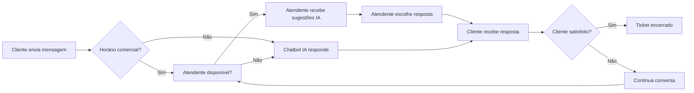

# Guia Prático: Como Usar e Vender a IA no Zechat

Este documento explica de forma simples e prática como você (fornecedor) pode vender o Zechat com IA para seus clientes, e como seus clientes usarão o sistema no dia a dia.

---

## ÍNDICE

1. [Você é o Fornecedor - Como Vender](#1-você-é-o-fornecedor---como-vender)
2. [Seu Cliente é a Empresa - Como Usar](#2-seu-cliente-é-a-empresa---como-usar)
3. [O Atendente - Como Trabalhar com IA](#3-o-atendente---como-trabalhar-com-ia)
4. [O Cliente Final - Como é a Experiência](#4-o-cliente-final---como-é-a-experiência)
5. [Cenários Reais de Uso](#5-cenários-reais-de-uso)
6. [Perguntas Frequentes](#6-perguntas-frequentes)

---

## 1. VOCÊ É O FORNECEDOR - COMO VENDER

### 1.1 O Que Você Está Vendendo?

Você está vendendo um **sistema de atendimento com Inteligência Artificial** que ajuda empresas a:

- ✅ Responder clientes automaticamente 24/7
- ✅ Ajudar atendentes humanos a responder mais rápido
- ✅ Resumir conversas longas para economizar tempo
- ✅ Classificar tickets por prioridade automaticamente

### 1.2 Como Configurar para Seu Cliente

#### Passo 1: Criar o Tenant (Empresa do Cliente)

No painel administrativo do Zechat:

1. Acesse: **Admin → Tenants → Novo Tenant**
2. Preencha os dados da empresa:
   - Nome: "Loja Exemplo Ltda"
   - Email do responsável: "contato@lojaexemplo.com.br"
   - Plano: Escolha (Starter, Pro ou Enterprise)

#### Passo 2: Configurar o Plano com IA

No painel de planos:

1. Acesse: **Admin → Planos**
2. Escolha o plano para o cliente
3. Configure os limites de IA:

| Plano | O que o cliente pode usar |
|-------|---------------------------|
| **Starter** | 100 sugestões/mês, 50 respostas de chatbot/mês |
| **Pro** | 1.000 sugestões/mês, 500 respostas de chatbot/mês |
| **Enterprise** | Ilimitado |

#### Passo 3: Configurar as Credenciais de IA

Você precisa configurar as chaves de API da OpenAI ou Anthropic:

1. No servidor, edite o arquivo `.env`:
   ```bash
   OPENAI_API_KEY=sk-sua-chave-aqui
   OPENAI_MODEL=gpt-4o-mini
   ```

2. Ou configure por tenant no banco de dados:
   - Chave: `ai:provider`
   - Valor: `openai` ou `anthropic`

#### Passo 4: Entregar o Acesso ao Cliente

1. Crie um usuário administrador para o cliente
2. Envie o link de acesso: `https://seudominio.com.br/login`
3. Envie as credenciais (usuário e senha)

### 1.3 Como Cobrar do Cliente

Você pode cobrar de duas formas:

#### Opção A: Por Plano Mensal

| Plano | Preço Sugerido | Inclui |
|-------|----------------|--------|
| Starter | R$ 297/mês | 100 sugestões IA, 50 chatbot |
| Pro | R$ 897/mês | 1.000 sugestões IA, 500 chatbot |
| Enterprise | R$ 2.497/mês | Ilimitado |

#### Opção B: Por Uso de IA

- R$ 0,10 por sugestão de resposta
- R$ 0,15 por resposta de chatbot
- R$ 0,20 por resumo de conversa
- R$ 0,10 por classificação de ticket

---

## 2. SEU CLIENTE É A EMPRESA - COMO USAR

### 2.1 Primeiro Acesso

Quando seu cliente acessa o sistema pela primeira vez:

1. **Login**: Usuário e senha que você forneceu
2. **Dashboard**: Visão geral dos atendimentos
3. **Configuração Inicial**: Conectar o WhatsApp

### 2.2 Configurar o WhatsApp com IA

#### Passo 1: Conectar o WhatsApp

1. Acesse: **Canais → WhatsApp → Novo WhatsApp**
2. Escaneie o QR Code com o celular da empresa
3. Aguarde a conexão (aparecerá "Conectado")

#### Passo 2: Ativar o Chatbot com IA

1. Acesse: **Configurações → IA → Chatbot**
2. Ative a opção: "Chatbot Automático"
3. Configure o prompt (personalidade do bot):

```
Exemplo de prompt:
"Você é um assistente de atendimento da Loja Exemplo.
Seja educado, profissional e prestativo.
Se não souber responder, diga que vai transferir para um humano."
```

4. Configure quando o chatbot deve responder:
   - [x] Responder quando não houver atendente disponível
   - [x] Responder fora do horário comercial
   - [ ] Responder sempre

#### Passo 3: Ativar Sugestões para Atendentes

1. Acesse: **Configurações → IA → Sugestões**
2. Ative a opção: "Sugerir respostas para atendentes"
3. Configure quantas sugestões mostrar: 3

### 2.3 Monitorar o Uso de IA

1. Acesse: **Billing → Uso de IA**
2. Veja o consumo do mês:
   - Sugestões usadas: 45/100
   - Chatbot respondeu: 23/50
   - Tokens consumidos: 5.230/10.000

3. Se estiver perto do limite, o sistema avisa:
   - ⚠️ "Você usou 90% do limite de sugestões"

---

## 3. O ATENDENTE - COMO TRABALHAR COM IA

### 3.1 Recebendo uma Mensagem

Quando um cliente envia uma mensagem:

1. **Notificação**: O atendente vê o ticket na lista
2. **Abre o ticket**: Clica na conversa do cliente

### 3.2 Usando Sugestões de IA

No chat, o atendente vê:

```
Cliente: "Quero saber o preço do plano Pro"

💡 Sugestões de IA:
[1] "O plano Pro custa R$ 897/mês e inclui..."
[2] "O plano Pro é R$ 897/mês. Quer que eu te envie os detalhes?"
[3] "Temos o plano Pro por R$ 897/mês com recursos avançados..."
```

**Como usar:**
- Clique em uma sugestão para usar
- Edite antes de enviar, se necessário
- Ou digite sua própria resposta

### 3.3 Pedindo um Resumo da Conversa

Se a conversa está longa:

1. Clique no botão: "📝 Resumir Conversa"
2. Aguarde 2-3 segundos
3. O resumo aparece:

```
📋 Resumo da Conversa:
Cliente interessado no plano Pro. Dúvidas sobre:
- Preço (R$ 897/mês)
- Recursos incluídos
- Forma de pagamento

Sentimento: Positivo
Sugestão: Oferecer teste grátis de 7 dias
```

### 3.4 Classificando o Ticket com IA

1. Clique no botão: "🏷️ Classificar Ticket"
2. A IA analisa a conversa e sugere:
   - Categoria: "Vendas"
   - Prioridade: "Alta"
   - Fila sugerida: "Comercial"
3. Clique em "Aplicar" para usar a classificação

---

## 4. O CLIENTE FINAL - COMO É A EXPERIÊNCIA

### 4.1 Enviando uma Mensagem

O cliente envia uma mensagem pelo WhatsApp normalmente:

```
Cliente: "Oi, quero saber o preço do plano Pro"
```

### 4.2 Resposta do Chatbot (IA)

Se não houver atendente disponível:

```
Chatbot IA: "Olá! 👋 Sou o assistente virtual da Loja Exemplo.

O plano Pro custa R$ 897/mês e inclui:
✅ 1.000 sugestões de IA por mês
✅ 500 respostas de chatbot
✅ Suporte prioritário
✅ Resumo de conversas

Quer que eu te envie mais detalhes ou prefere falar com um atendente?"
```

### 4.3 Transferindo para Humano

Se o cliente quiser falar com humano:

```
Cliente: "Quero falar com atendente"

Chatbot IA: "Sem problemas! Vou transferir você para um atendente.
Um momento, por favor... ⏳"
```

O ticket é transferido para a fila de atendimento.

### 4.4 Atendimento com Sugestões de IA

Quando o atendente responde, ele usa as sugestões da IA para responder mais rápido:

```
Atendente: "Claro! O plano Pro é R$ 897/mês. Quer que eu te envie o contrato?"
```

---

## 5. CENÁRIOS REAIS DE USO

### Cenário 1: E-commerce - Atendimento 24/7

**Empresa:** Loja de roupas online

**Problema:** Recebia muitas mensagens fora do horário comercial

**Solução com IA:**
- Chatbot atende 24/7
- Responde perguntas frequentes (prazo, troca, pagamento)
- Transfere para humano apenas quando necessário

**Resultado:**
- 70% das mensagens resolvidas pelo chatbot
- Atendentes focam em casos complexos
- Clientes satisfeitos com resposta rápida

### Cenário 2: Clínica Médica - Agendamentos

**Empresa:** Clínica de odontologia

**Problema:** Atendentes perdiam tempo respondendo as mesmas perguntas

**Solução com IA:**
- Sugestões de IA para agendamentos
- Chatbot confirma horários disponíveis
- Classificação automática de urgência

**Resultado:**
- Tempo de resposta reduziu 60%
- Atendentes conseguem atender 2x mais pacientes
- Menos erros de agendamento

### Cenário 3: Imobiliária - Qualificação de Leads

**Empresa:** Imobiliária

**Problema:** Muitos leads não qualificados wasting tempo dos corretores

**Solução com IA:**
- Chatbot qualifica leads automaticamente
- Classifica por interesse (comprar, alugar, valor)
- Resumo da conversa para o corretor

**Resultado:**
- Corretores recebem apenas leads qualificados
- 40% mais vendas com o mesmo time
- Melhor experiência para o cliente

---

## 6. PERGUNTAS FREQUENTES

### Para Você (Fornecedor)

**P: Preciso pagar pela API da OpenAI?**
R: Sim, você precisa de uma conta na OpenAI. O custo é aproximado de US$ 0,50 por 1 milhão de tokens (muito barato).

**P: Posso usar outro provedor além da OpenAI?**
R: Sim! O sistema suporta OpenAI e Anthropic. Você pode escolher o que preferir.

**P: Como faço backup das configurações de IA?**
R: As configurações ficam no banco de dados. Faça backup regular do PostgreSQL.

**P: Posso desativar a IA para um cliente específico?**
R: Sim, basta acessar as configurações do tenant e desativar a IA.

### Para Seu Cliente

**P: A IA vai substituir meus atendentes?**
R: Não! A IA ajuda os atendentes a trabalharem melhor, não substitui eles. Ela responde perguntas simples e deixa os atendentes focarem em casos complexos.

**P: Posso personalizar as respostas do chatbot?**
R: Sim! Você pode configurar a personalidade do bot, o tom de voz e até respostas específicas.

**P: O que acontece se a IA errar uma resposta?**
R: O atendente pode corrigir antes de enviar. Além disso, você pode treinar a IA com exemplos de respostas corretas.

**P: Como sei se estou usando muito a IA?**
R: No painel de billing você vê o consumo em tempo real. O sistema avisa quando está perto do limite.

**P: Posso aumentar meu limite de IA?**
R: Sim! Entre em contato com seu fornecedor para fazer upgrade de plano.

### Para o Atendente

**P: Sou obrigado a usar as sugestões de IA?**
R: Não! As sugestões são apenas ajuda. Você pode digitar sua própria resposta se preferir.

**P: A IA aprende com minhas respostas?**
R: Sim! Quanto mais você usa, melhor a IA fica em sugerir respostas adequadas ao seu estilo.

**P: Posso pedir resumo de qualquer conversa?**
R: Sim! Basta clicar no botão de resumo em qualquer ticket.

**P: O que acontece se eu não gostar de uma sugestão?**
R: Ignore e digite sua própria resposta. A IA vai aprender com isso.

---

## 7. DICAS PARA SUCESSO

### Para Você (Fornecedor)

1. **Comece com o plano Pro** - É o melhor custo-benefício para a maioria dos clientes
2. **Ofereça treinamento** - Ensine seus clientes a usar a IA
3. **Monitore o uso** - Acompanhe se os clientes estão usando os limites
4. **Atualize os prompts** - Melhore as respostas do chatbot periodicamente

### Para Seu Cliente

1. **Configure bem o prompt** - Um bom prompt = boas respostas
2. **Treine seus atendentes** - Ensine eles a usar as sugestões
3. **Monitore os resultados** - Veja o que está funcionando e o que não
4. **Peça feedback** - Pergunte aos clientes se gostaram do atendimento

### Para o Atendente

1. **Use as sugestões** - Elas economizam tempo
2. **Personalize** - Edite as sugestões antes de enviar
3. **Dê feedback** - Se a sugestão foi ruim, digite sua própria resposta
4. **Use o resumo** - Antes de atender, leia o resumo da conversa

---

## 8. RESUMO VISUAL



---

## 9. PRÓXIMOS PASSOS

1. **Configure o ambiente** - Siga o guia de setup
2. **Teste com um cliente piloto** - Use você mesmo primeiro
3. **Crie materiais de venda** - Apresentações, vídeos, demos
4. **Lance para seus clientes** - Comece com planos Pro
5. **Colete feedback** - Melhore continuamente

---

**Dúvidas?** Entre em contato com o suporte do Zechat.