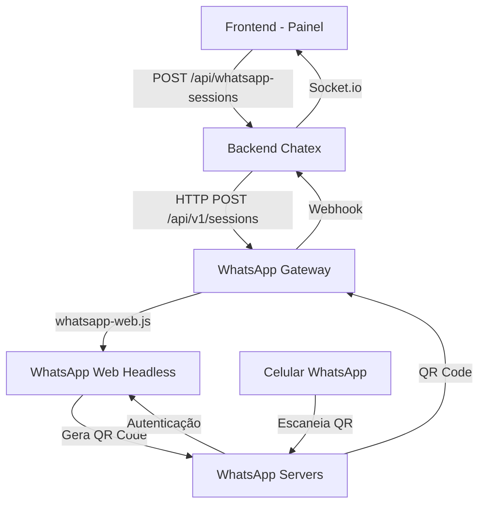
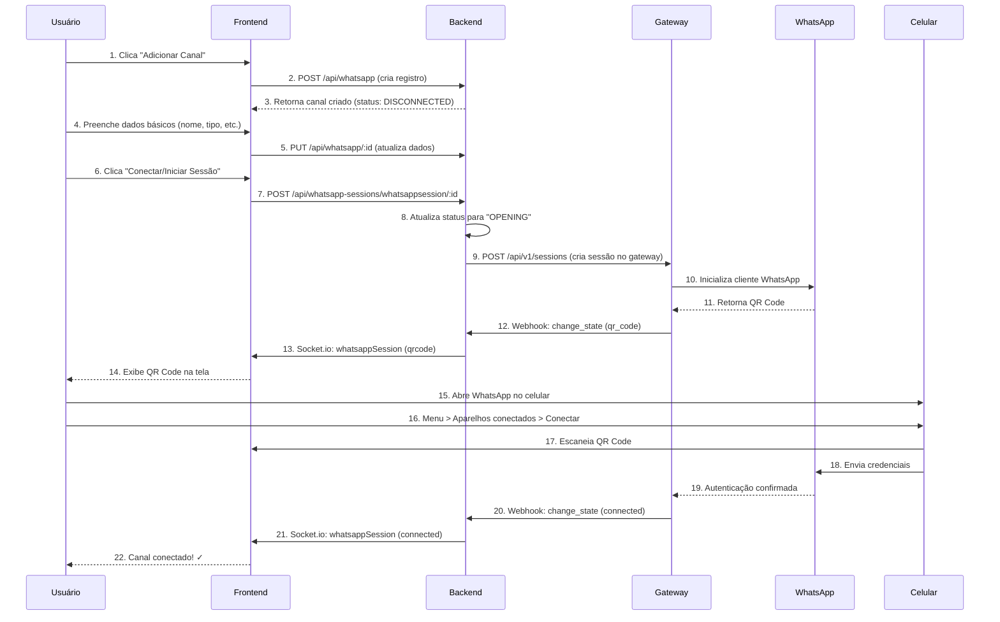
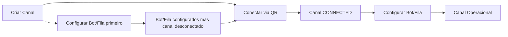

# Guia de Configuração de Canais WhatsApp

## 📋 Sumário

1. [Visão Geral](#visão-geral)
2. [Arquitetura do Sistema](#arquitetura-do-sistema)
3. [Fluxo Completo de Configuração](#fluxo-completo-de-configuração)
4. [Guia Passo a Passo](#guia-passo-a-passo)
5. [Gerenciamento de QR Code](#gerenciamento-de-qr-code)
6. [Relação entre Canal, Bot e Fila](#relação-entre-canal-bot-e-fila)
7. [Solução de Problemas](#solução-de-problemas)
8. [Boas Práticas](#boas-práticas)
9. [Limites e Restrições](#limites-e-restrições)
10. [FAQ](#faq)

---

## 🎯 Visão Geral

Este documento descreve o processo completo de configuração de canais de WhatsApp na plataforma Chatex, incluindo o funcionamento do QR Code, fluxos de autenticação e melhores práticas operacionais.

### O que é o QR Code do WhatsApp?

O QR Code solicitado pelo sistema é **o mesmo QR Code do "Conectar novo dispositivo" do WhatsApp Web/WhatsApp Business**. 

- **Tecnologia:** Utiliza a biblioteca `whatsapp-web.js` via WhatsApp Gateway
- **Autenticação:** O QR Code é gerado pelo próprio WhatsApp quando o gateway solicita uma nova conexão
- **Segurança:** Ao escanear o QR Code, você autentica a sessão do gateway como um dispositivo conectado via WhatsApp Web

---

## 🏗️ Arquitetura do Sistema



### Componentes Principais

| Componente | Descrição | Arquivos Principais |
|------------|-----------|-------------------|
| **Frontend** | Interface do usuário para configuração | `frontend/src/service/sessoesWhatsapp.js` |
| **Backend** | API principal e lógica de negócio | `backend/src/controllers/WhatsAppSessionController.ts` |
| **WhatsApp Gateway** | Serviço dedicado para conexões WhatsApp | `28web-whatsapp-gateway/` |
| **WhatsApp Client** | Cliente individual para cada conexão | `28web-whatsapp-gateway/src/services/WhatsAppClient.ts` |

---

## 🔄 Fluxo Completo de Configuração



### Detalhes dos Endpoints

| Passo | Ação | Método/Endpoint | Arquivo |
|-------|------|-----------------|---------|
| 1-3 | Criar canal | `POST /api/whatsapp` | [`backend/src/routes/whatsappRoutes.ts:13`](backend/src/routes/whatsappRoutes.ts:13) |
| 4-5 | Configurar dados básicos | `PUT /api/whatsapp/:id` | [`backend/src/routes/whatsappRoutes.ts:12`](backend/src/routes/whatsappRoutes.ts:12) |
| 6-9 | Iniciar sessão | `POST /api/whatsapp-sessions/whatsappsession/:id` | [`backend/src/routes/whatsappSessionRoutes.ts:9`](backend/src/routes/whatsappSessionRoutes.ts:9) |
| 10-14 | Gerar e exibir QR | `POST /api/v1/sessions` | [`backend/src/services/WbotServices/StartWhatsAppSession.ts:13`](backend/src/services/WbotServices/StartWhatsAppSession.ts:13) |
| 15-22 | Autenticar e conectar | Webhook events | [`28web-whatsapp-gateway/src/services/WhatsAppClient.ts:56`](28web-whatsapp-gateway/src/services/WhatsAppClient.ts:56) |

---

## 📋 Guia Passo a Passo

### Pré-requisitos

- ✅ Celular com WhatsApp Business instalado
- ✅ Número de telefone dedicado ao sistema
- ✅ Conexão estável de internet no celular
- ✅ Bateria suficiente (>20% recomendado)
- ✅ Permissões de administrador no painel

### Passo 1: Criar o Canal

1. Acesse o painel administrativo
2. Navegue para **Canais > WhatsApp**
3. Clique em **"Adicionar Canal"**
4. Preencha os campos obrigatórios:
   - **Nome:** Identificação interna do canal
   - **Tipo:** Selecione "whatsapp"
   - **Tenant:** Organização/empresa
5. Clique em **"Salvar"**

> **Resultado:** Canal criado com status `DISCONNECTED`

### Passo 2: Configurar Dados Básicos

1. Selecione o canal recém-criado
2. Edite as informações conforme necessário:
   - **Nome:** Pode ser alterado
   - **Número:** Telefone do WhatsApp (formato internacional)
   - **É padrão?:** Define como canal principal
3. Configure as associações (opcional neste momento):
   - **Bot (ChatFlow):** Fluxo de atendimento automatizado
   - **Fila:** Distribuição de atendimentos
4. Clique em **"Atualizar"**

### Passo 3: Conectar via QR Code

1. Com o canal selecionado, clique em **"Conectar"** ou **"Iniciar Sessão"**
2. Aguarde o QR Code aparecer na tela
   - Status mudará para `OPENING`
   - QR Code será gerado em até 10 segundos
3. No celular:
   - Abra o WhatsApp
   - Vá em **Menu > Aparelhos conectados**
   - Clique em **"Conectar um dispositivo"**
   - Escaneie o QR Code exibido no painel
4. Aguarde a confirmação de conexão

> **✅ Sucesso:** Status mudará para `CONNECTED` e o número do telefone será exibido

### Passo 4: Validação

1. Verifique o status: deve ser `CONNECTED`
2. Confirme o número do telefone exibido
3. Envie uma mensagem de teste para o número conectado
4. Verifique se a mensagem aparece no painel

---

## 🔲 Gerenciamento de QR Code

### Como o QR Code é Gerado

1. **Responsável:** WhatsApp Gateway (`28web-whatsapp-gateway`)
2. **Processo:**
   - Backend solicita criação de sessão ao gateway
   - Gateway inicializa cliente `whatsapp-web.js`
   - Evento `qr` é disparado pelo WhatsApp
   - QR Code é convertido para base64 e enviado via webhook

### Características do QR Code

| Propriedade | Detalhes |
|-------------|----------|
| **Validade** | ~20-30 segundos após geração |
| **Tentativas** | 5 tentativas permitidas por sessão |
| **Formatação** | Base64 Data URL (exibido diretamente no navegador) |
| **Expiração** | Automática após escaneio ou timeout |

### Gerando Novo QR Code

Se o QR Code expirar ou houver erro:

1. Clique em **"Gerar Novo QR Code"**
2. Sistema irá:
   - Deletar sessão atual no gateway
   - Criar nova sessão
   - Gerar novo QR Code
3. Repita o processo de escaneamento

> **Endpoint:** `PUT /api/whatsapp-sessions/whatsappsession/:id` com `isQrcode: true`

---

## 🔗 Relação entre Canal, Bot e Fila

### Estrutura de Dados

A tabela `Whatsapp` contém os seguintes campos relacionados:

| Campo | Tipo | Descrição |
|-------|------|-----------|
| `chatFlowId` | FK (ChatFlow) | Bot associado ao canal |
| `queueId` | FK (Queue) | Fila de atendimento associada |

### Fluxo de Configuração



### Regras de Negócio

1. **Independência de configuração:**
   - Bot e Fila podem ser configurados **antes ou depois** da conexão via QR
   - Configurações são persistidas independentemente do status da conexão

2. **Canal desconectado com Bot/Fila configurados:**
   - ✅ Configurações mantidas no banco
   - ❌ Mensagens não são recebidas
   - ❌ Bot não é acionado
   - ❌ Fila não distribui tickets

3. **Canal reconectado:**
   - ✅ Configurações de Bot/Fila aplicadas automaticamente
   - ✅ Sistema volta a operar normalmente

### Recomendação

> **Conectar o canal primeiro** para validar a conexão, depois configurar Bot e Fila. Isso evita configurações desnecessárias em canais que não podem ser conectados.

---

## ⚠️ Solução de Problemas

### Status de Erro Comuns

| Status | Causa Provável | Solução |
|--------|----------------|---------|
| `DISCONNECTED` | Celular sem internet | Verificar conexão do celular |
| `DISCONNECTED` | Celular sem bateria/desligado | Carregar celular e ligar |
| `DISCONNECTED` | WhatsApp fechado no celular | Abrir WhatsApp no celular |
| `OPENING` | QR Code não escaneado | Escanear dentro de 20 segundos |
| `ERROR` | Múltiplas tentativas falhas | Gerar novo QR Code |

### Procedimentos de Recuperação

#### 1. QR Code não aparece

**Verificações:**
- Gateway está rodando? (`docker ps | grep 28web-whatsapp-gateway`)
- Logs do gateway: `docker logs 28web-whatsapp-gateway`
- Conexão entre backend e gateway

**Solução:**
```bash
# Verificar status do gateway
curl http://localhost:3001/health

# Reiniciar se necessário
docker restart 28web-whatsapp-gateway
```

#### 2. QR Code expira rapidamente

**Causa:** Timeout de 20-30 segundos do WhatsApp

**Solução:**
- Tenha o celular pronto antes de gerar o QR
- Escaneie imediatamente após aparecer
- Se expirar, gere um novo QR Code

#### 3. "Erro de comunicação" frequente

**Verificações:**
- Internet estável no celular
- WhatsApp aberto e em segundo plano
- Bateria acima de 20%

**Solução:**
- Manter WhatsApp sempre aberto
- Configurar otimização de bateria para não fechar o app
- Usar WiFi quando possível

#### 4. Canal cai frequentemente

**Causas Comuns:**
- WhatsApp fechado no celular
- Conexão internet instável
- Conflito com WhatsApp Web em outro dispositivo

**Solução:**
- Evitar usar WhatsApp Web simultaneamente
- Manter conexão estável
- Verificar configurações de economia de bateria

### Reconexão Automática

O sistema tenta reconexão automática após 2 segundos de desconexão:

```typescript
// wbotMonitor.ts - Reconexão automática
wbot.on("disconnected", async reason => {
  await whatsapp.update({
    status: "OPENING",
    session: "",
    qrcode: null
  });
  setTimeout(() => StartWhatsAppSession(whatsapp), 2000);
});
```

---

## ✅ Boas Práticas

### Operacionais

| Prática | ✅ Recomendado | ❌ Evitar |
|---------|----------------|-----------|
| **Uso do celular** | Manter WhatsApp aberto em segundo plano | Fechar o WhatsApp completamente |
| **Conexão** | Usar WiFi estável | Conexões móveis instáveis |
| **Bateria** | Manter >20% de carga | Deixar bateria acabar |
| **Dispositivos** | Usar número dedicado ao sistema | Compartilhar com uso pessoal |
| **WhatsApp Web** | Evitar uso simultâneo | Múltiplas sessões ativas |

### Monitoramento

O sistema monitora automaticamente:

- **Status da conexão:** Atualizações em tempo real via WebSocket
- **Nível de bateria:** Alerta quando < 20%
- **Qualidade da conexão:** Logs de eventos de desconexão

### Manutenção Preventiva

1. **Verificação diária:** Status dos canais
2. **Teste semanal:** Envio de mensagens teste
3. **Limpeza mensal:** Remover canais inativos
4. **Backup:** Configurações de canais

---

## 🚧 Limites e Restrições

### Limites do Sistema

| Limite | Configuração | Padrão |
|--------|--------------|--------|
| **Conexões por tenant** | `maxConnections` na tabela `Tenant` | Variável por cliente |
| **Limite global** | `CONNECTIONS_LIMIT` (env) | Configurado no deployment |
| **Tentativas de QR** | `qrMaxRetries` | 5 tentativas |
| **Timeout QR** | Configuração do WhatsApp | ~20-30 segundos |

### Restrições Técnicas

- **Sessões simultâneas:** Máximo 1 por número de telefone
- **Dispositivos:** Conflito com WhatsApp Web/Desktop
- **Validade:** Sessões expiram após inatividade prolongada
- **Segurança:** QR Codes são únicos e não reutilizáveis

### Compliance

- **Termos do WhatsApp:** Uso em conformidade com políticas do WhatsApp Business
- **LGPD:** Dados de conversas armazenados com consentimento
- **Rate Limiting:** Respeito aos limites de envio do WhatsApp

---

## ❓ FAQ

### Perguntas Frequentes

#### O QR Code é o mesmo do WhatsApp Web?
**Sim.** É exatamente o mesmo processo de "Conectar novo dispositivo" do WhatsApp Web/WhatsApp Business.

#### Posso usar meu WhatsApp pessoal?
**Não é recomendado.** Use um número dedicado ao sistema para evitar conflitos e garantir disponibilidade.

#### O que acontece se meu celular ficar sem bateria?
**A conexão será perdida.** O canal status mudará para `DISCONNECTED` e será necessário reconectar quando o celular for ligado novamente.

#### Posso ter o WhatsApp Web aberto simultaneamente?
**Não.** Isso causará conflito de sessão e uma das conexões será encerrada.

#### Com que frequência devo reconectar o canal?
**Normalmente não é necessário.** A conexão permanece ativa enquanto o WhatsApp estiver aberto no celular com internet.

#### O QR Code expira?
**Sim.** O QR Code expira em aproximadamente 20-30 segundos se não for escaneado.

#### Quantos canais posso configurar?
**Depende do seu plano.** Verifique o limite `maxConnections` do seu tenant ou `CONNECTIONS_LIMIT` global.

#### Como faço backup das configurações?
**As configurações são persistidas** no banco de dados. Faça backup regular do banco de dados.

#### O sistema funciona com WhatsApp Business API?
**Não.** Esta implementação usa WhatsApp Web via `whatsapp-web.js`. Para API Business, consulte a configuração WABA.

---

## 📞 Suporte

### Contatos de Suporte Técnico

- **Documentação:** Este guia e os comentários no código
- **Logs:** Verifique logs do backend e gateway para diagnósticos
- **Monitoramento:** Use o painel para verificar status em tempo real

### Informações para Diagnóstico

Ao reportar problemas, inclua:

1. **ID do Canal:** Identificador numérico
2. **Status Atual:** DISCONNECTED, OPENING, CONNECTED, ERROR
3. **Logs Relevantes:** Mensagens de erro ou warnings
4. **Passos Reproduzíveis:** O que foi feito antes do problema
5. **Ambiente:** Versão do sistema, navegador, celular

---

## 📝 Histórico de Alterações

| Versão | Data | Alterações |
|--------|------|------------|
| 1.0 | 2024-12-23 | Versão inicial - Documentação completa do fluxo de configuração |

---

*Este documento foi baseado na análise do código-fonte da plataforma Chatex, versão atual. Para informações atualizadas, consulte sempre o repositório mais recente.*