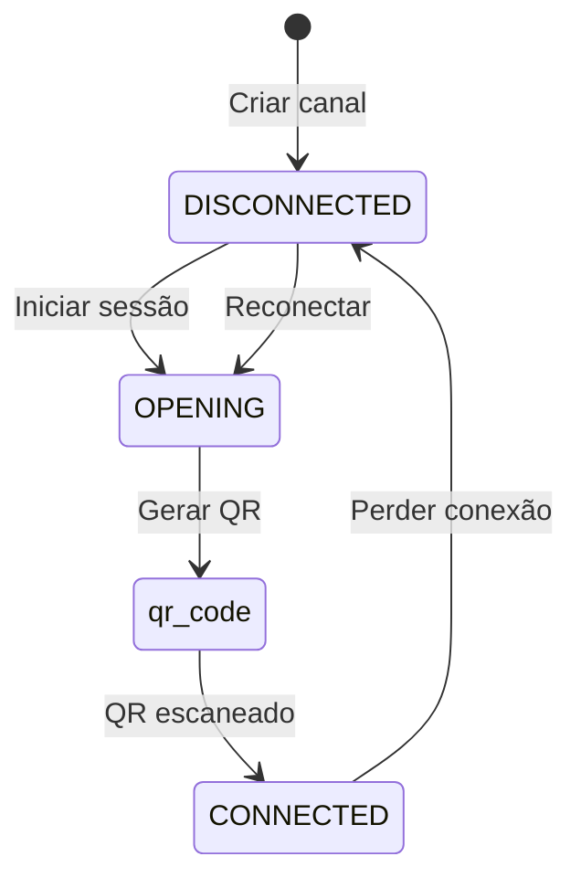

# Guia Rápido: Configuração de Canais WhatsApp

## ⚡ Resumo Executivo

Este é um guia rápido para configuração de canais WhatsApp. Para documentação completa, consulte [WHATSAPP_CHANNEL_SETUP_GUIDE.md](WHATSAPP_CHANNEL_SETUP_GUIDE.md).

---

## 🚀 Configuração em 5 Passos

### 1. Criar Canal
```
Painel > Canais > WhatsApp > Adicionar Canal
Preencher: Nome, Tipo: whatsapp, Tenant
Salvar → Status: DISCONNECTED
```

### 2. Configurar Dados
```
Editar canal > Preencher número telefone
Configurar Bot/Fila (opcional)
Atualizar
```

### 3. Conectar QR Code
```
Clicar "Conectar" > Aguardar QR Code
Celular: WhatsApp > Menu > Aparelhos conectados > Conectar
Escanear QR Code
```

### 4. Validar Conexão
```
Status deve mudar para: CONNECTED
Número telefone exibido
Enviar mensagem teste
```

### 5. Finalizar Configuração
```
Associar Bot (ChatFlow)
Associar Fila de atendimento
Definir como padrão (se necessário)
```

---

## 🔄 Fluxo de Status



---

## ⚠️ Problemas Comuns

| Problema | Causa | Solução |
|----------|-------|---------|
| QR não aparece | Gateway offline | Verificar serviço gateway |
| QR expira | Demora >20s | Escanear imediatamente |
| "Erro comunicação" | Celular sem internet | Verificar conexão celular |
| Canal cai | WhatsApp fechado | Manter app aberto |
| Conflito sessão | WhatsApp Web ativo | Fechar outras sessões |

---

## ✅ Boas Práticas

### ✅ FAÇA
- Manter WhatsApp aberto no celular
- Usar número dedicado ao sistema
- Manter bateria >20%
- Usar conexão WiFi estável

### ❌ NÃO FAÇA
- Fechar WhatsApp no celular
- Usar simultaneamente com WhatsApp Web
- Compartilhar número com uso pessoal
- Deixar bateria acabar

---

## 📱 Comandos Rápidos

### Gerar Novo QR Code
```
PUT /api/whatsapp-sessions/whatsappsession/:id
Body: { "isQrcode": true }
```

### Verificar Status
```
GET /api/whatsapp/:whatsappId
```

### Desconectar Canal
```
DELETE /api/whatsapp-sessions/whatsappsession/:whatsappId
```

---

## 🔧 Diagnóstico Rápido

### Verificar Gateway
```bash
curl http://localhost:3001/health
docker logs 28web-whatsapp-gateway
```

### Verificar Logs Backend
```bash
# Logs de sessão WhatsApp
grep "StartWhatsAppSession" logs/app.log
grep "whatsappSession" logs/app.log
```

### Testar Conexão
1. Status: CONNECTED?
2. Número telefone visível?
3. Mensagem teste recebida?

---

## 📊 Limites Importantes

| Item | Limite | Onde Configurar |
|------|--------|-----------------|
| Conexões por tenant | `maxConnections` | Tabela `Tenant` |
| Limite global | `CONNECTIONS_LIMIT` | Variável ambiente |
| Tentativas QR | 5 | Gateway |
| Timeout QR | ~20s | WhatsApp |

---

## 🆘 Emergências

### Canal Cai Inesperadamente
1. Verificar internet do celular
2. Abrir WhatsApp no celular
3. Aguardar reconexão automática (2s)
4. Se não reconectar: "Reconectar" no painel

### QR Code Não Funciona
1. Gerar novo QR Code
2. Fechar outras sessões WhatsApp Web
3. Reiniciar aplicativo WhatsApp no celular
4. Tentar novamente

### Problemas Persistentes
1. Verificar logs do gateway
2. Reiniciar serviço gateway
3. Verificar configurações de firewall
4. Contatar suporte técnico

---

## 📞 Contato Suporte

Ao abrir chamado, informe:
- ID do Canal
- Status atual
- Logs de erro
- Passos reproduzíveis

---

*Para documentação completa, consulte [WHATSAPP_CHANNEL_SETUP_GUIDE.md](WHATSAPP_CHANNEL_SETUP_GUIDE.md)*